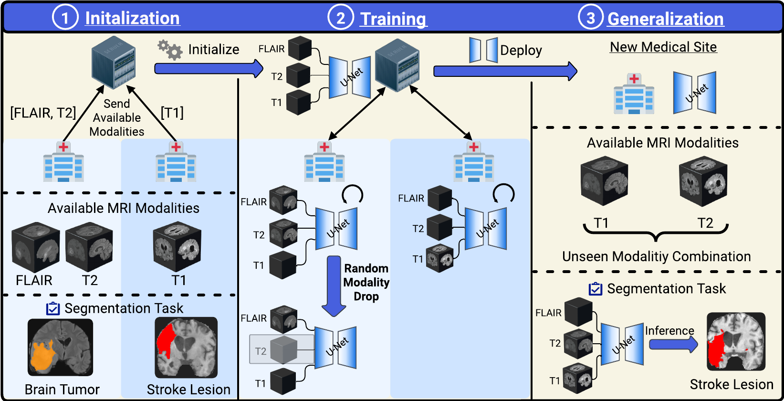

# [WACV 2025 ORAL 🔥] 🧠 Feasibility of Federated Learning from Client Databases with Different Brain Diseases and MRI Modalities

<h5 align="center">

[](https://arxiv.org/pdf/2406.11636)
[](https://github.com/FelixWag/FedUniBrain/blob/main/LICENSE)
 <br>

</h5>

---
🔥 **NEWS**: FedUniBrain got accepted at WACV 2025 (oral)🔥

This repository contains the official implementation of our paper, Wagner et al.,  [Feasibility of Federated Learning from Client Databases with Different Brain Diseases and MRI Modalities](https://arxiv.org/pdf/2406.11636), accepted at WACV 2025 and selected for an oral. If you find this code useful for your research, please cite our paper. The BibTeX citation and references to prior research on which this code is based can be found [at the end](#citation) of the README.



## Introduction

---
Segmentation models for brain lesions in MRI are traditionally designed for specific diseases and require predefined sets of MRI modalities during training and inference. This limitation prevents reduces model's generalizability or handling scans with different modality combinations. Additionally, the confidentiality of medical data often prevents central aggregation of large datasets. Therefore, decentralized training approaches are needed.

We propose a novel Federated Learning (FL) framework **FedUniBrain** that enables training a single 3D segmentation model across decentralized databases with diverse brain pathologies and MRI modalities. 

## Installation

---
### Dependencies
We recommend using **conda** for installing the dependencies. The following command will create a new environment with all the required dependencies:
```
conda env create -f environment.yml
conda activate FedUniBrain
```
Alternatively, you can install the dependencies manually. The code depends on the following packages (tested on the following versions) using ``Python`` version 3.10. Often, setting up conda environments with configuration files can lead to errors. To save you the trouble, I tested it by installing the packages in this order: ``pytorch`` version 2.0.1; ``pip install monai[all]`` (version 1.3.0; this includes the nibabel reader); ``tqdm`` version 4.67.1; ``wandb`` version 0.19.4; ``conda install numpy=1.26.4`` (**Attention**: a numpy version below 2.0 is needed because of some compatibility issues with monai packages).

**Note:** *We use Weights & Biases (WandB) to log and track experiments. Make sure to log in to your WandB account before running the code.*

## Data

We use the following public databases in our experiments:

- [ATLAS 2.0](https://fcon_1000.projects.nitrc.org/indi/retro/atlas.html)
- [Brats (2016+2017)](http://medicaldecathlon.com)
- [ISLES 2015](https://www.isles-challenge.org/ISLES2015/)
- [MSSEG 2016](https://www.nature.com/articles/s41598-018-31911-7)
- [WMH 2017](https://wmh.isi.uu.nl/#_Data)

Additionally, we used the TBI and Tumor 2 database in our experiments. Unfortunately, they are not publicly available since they are from our institutions. You are welcome to use other public datasets or your own data instead.

We used the following pre-processing steps. The pre-processing scripts can be found in the ``data_preprocessing`` directory. **Note:** we use the same pre-processing scripts and steps from our previous [MultiUnet paper's](https://arxiv.org/pdf/2405.18511) [2] [GitHub repository](https://github.com/WenTXuL/MultiUnet?tab=readme-ov-file).

- **Skull Stripping:** For datasets containing the skull (e.g., ATLAS), we use the [ROBEX](https://www.nitrc.org/projects/robex) tool to remove the skull first.
- **Intensity Normalization:** For all datasets, we perform z-score normalization of the image intensities, calculated using the mean and standard deviation of the brain area.
- **Image Concatenation:** For each patient, we combine the 3D images of all available modalities into a single 4D image and save it as one file.
- **Image Orientation:** We do not perform registration, but for consistency across datasets, we flipped the axes of images in certain databases (e.g., WMH, MSSEG) to ensure uniform brain orientations. The script ``data_preprocessing/preprocess_flip.py`` extends ``data_preprocessing/preprocess.py`` by adding functionality to flip the images.
- **Binary Label Creation:** For datasets with multi-class labels (e.g., BRATS), we merge certain label classes to generate binary labels. Code for this merging process is provided in ``data_preprocessing/merge_labels.py``

After downloading and pre-processing the data. Move the data into a single folder `data` folder and create for each database a folder with the MRI scans themselves and a folder with the segmentations (e.g. `ATLAS/images` and `ATLAS/segmentations`). Then you need to update the configuration file in `./configs/config_brain_mri.ini` with your local specification. The configuration file has the following structure:

### Config file structure
You have to update the following sections:

|      Section name      | Keys and values                                                                                                                                                                                                                                                           | Description                                                                                                                                   |
|:----------------------:|---------------------------------------------------------------------------------------------------------------------------------------------------------------------------------------------------------------------------------------------------------------------------|-----------------------------------------------------------------------------------------------------------------------------------------------|
|     `[data_path]`      | The key must be `root_data` and the value must be the path where the images are stored: E.g. `root_data = /path/to/images`                                                                                                                                                | This section defines the location where the actual images are stored.                                                                         |
| `[clients_data_path]`  | Each database should have corresponding keys that match their names in the `[client_names]` section, followed by '_img' and '_seg'. To specify the name of the folder for the images and segmentations respectively. The keys must be the path to the corresponding file. | This section is used to define the name of the folders for the images and segmentations in the ``root_data``.                                 |
|    `[client_names]`    | **Note:** This section only requires keys! No values are needed. The keys represent the name of each client                                                                                                                                                               | The names of each client                                                                                                                      |


## Usage

---
In the `./scripts` folder, an example script is provided. You can use is as a starting point for your own experiments. To start running experiments and train models, you can use the `main_federated.py` script by executing the following command:

```bash
python3 ../main_federated.py --experiment_name "train_on_atlas_brats" --gpu 0 --datasets "ATLAS" "BRATS" --evaluation_datasets "ATLAS" "BRATS" --num_workers 8 --equal_weighting --batch_size 8 --norm "BATCH" --aggregation_method "fedbn" --loss_argument "diceandsoftbce:bce_weight=0.2,dice_weight=0.8,label_smoothing=0.15" --validation_interval 5
```

An overview of most relevant arguments is given below:

|           Parameter            | Description                                                                                                                                                                                                                                                                                                                                                                |
|:------------------------------:|----------------------------------------------------------------------------------------------------------------------------------------------------------------------------------------------------------------------------------------------------------------------------------------------------------------------------------------------------------------------------|
|              `E`               | Number of communication rounds                                                                                                                                                                                                                                                                                                                                             |
|              `lr`              | Learning rate                                                                                                                                                                                                                                                                                                                                                              |
|          `optimizer`           | Which optimizer to use. Currently supported: `[SGD, ADAM]`                                                                                                                                                                                                                                                                                                                 |
|       `equal_weighting`        | If this flag is set, the server weights each client model equally during the averaging step. If the flag is not set, the server weights each model according to its dataset size during the averaging step.                                                                                                                                                                |
|           `datasets`           | List a name of clients that participate in the training loop. They must match the names in the corresponding config file. E.g.: `--datasets 'ATLAS' 'BRATS'`                                                                                                                                                                                                               |
|     `evaluation_datasets`      | List a name of clients on which we want to evaluate the model during training. They must match the names in the corresponding config file. E.g.: `--datasets 'ATLAS' 'BRATS'`                                                                                                                                                                                              |
|      `aggregation_method`      | Specify the aggregation method on the server. Current choices: `['fedavg','fedbn']`                                                                                                                                                                                                                                                                                        |


To get a description of all available arguments, you can use the following command:

```bash
python main_federated.py --help
```


## Citation

---

```
@misc{wagner2024feasibilityfederatedlearningclient,
      title={Feasibility of Federated Learning from Client Databases with Different Brain Diseases and MRI Modalities}, 
      author={Felix Wagner and Wentian Xu and Pramit Saha and Ziyun Liang and Daniel Whitehouse and David Menon and Virginia Newcombe and Natalie Voets and J. Alison Noble and Konstantinos Kamnitsas},
      year={2024},
      url={https://arxiv.org/abs/2406.11636}, 
}

@article{xu2024feasibility,
  title={Feasibility and benefits of joint learning from MRI databases with different brain diseases and modalities for segmentation},
  author={Xu, Wentian and Moffat, Matthew and Seale, Thalia and Liang, Ziyun and Wagner, Felix and Whitehouse, Daniel and Menon, David and Newcombe, Virginia and Voets, Natalie and Banerjee, Abhirup and others},
  journal={arXiv preprint arXiv:2405.18511},
  year={2024}
}

@misc{wagner2023postdeployment,
      title={Post-Deployment Adaptation with Access to Source Data via Federated Learning and Source-Target Remote Gradient Alignment}, 
      author={Felix Wagner and Zeju Li and Pramit Saha and Konstantinos Kamnitsas},
      year={2023}
}
```

## References

---
[1] Wagner et al., “Feasibility of Federated Learning from Client Databases with Different Brain Diseases and MRI Modalities” 2025, WACV 2025

[2] Xu et al., "Feasibility of Federated Learning from Client Databases with Different Brain Diseases and MRI Modalities" 2024, MIDL 2024

[3] Wagner et al., "Post-Deployment Adaptation with Access to Source Data via Federated Learning and Source-Target Remote Gradient Alignment" 2023, MLMI @ MICCAI 2023

## Contact

**Felix Wagner**

I hope you find this code useful and valuable! Your feedback, comments, and suggestions are highly appreciated.

If you have any questions, encounter issues, or want to share your thoughts, please don't hesitate to reach out:

📧 Email: felix.wagner (AT) eng.ox.ac.uk

## License
This project is licensed under the [MIT license](LICENSE)

Copyright (c) 2025 Felix Wagner
